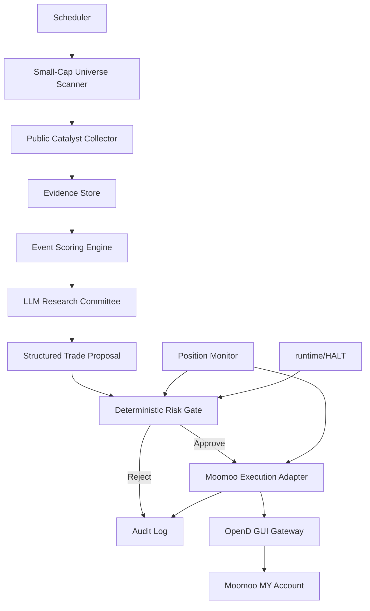

# Moomoo MY Small-Cap Event-Driven Options Agent

## 1. Objective

Build an autonomous research and execution agent for a dedicated USD 100 live
account on Moomoo MY.

The agent searches for optionable U.S. small-cap equities with public catalysts,
selects long option contracts, places orders automatically, manages exits, and
records the evidence behind every decision.

This is an aggressive experiment, not a promise of returns. The agent may decide
what to trade without per-order human approval, but it must never bypass the
deterministic risk gate. Use public or user-provided information only. Do not
claim to detect actual insider trading.

## 2. Confirmed Platform Facts

As of 2026-06-02:

- Moomoo MY supports U.S. options paper trading and live trading through Moomoo
  API. Official reference:
  <https://openapi.moomoo.com/moomoo-api-doc/en/>
- Moomoo MY requires an options account application and approval before live
  options trading. Official reference:
  <https://www.moomoo.com/my/invest/us-options>
- OpenD is the local gateway. The SDK connects to `127.0.0.1:11111`.
- This machine already has Python `3.13.0` and `moomoo-api` `10.6.6608`.
- OpenD was not running and was not found in common installation paths during
  the initial check.
- Live trading must be unlocked manually in the OpenD GUI. Do not call
  `unlock_trade()` from agent code and do not store the trading password.

## 3. MVP Scope

### Included

- U.S.-listed, optionable small-cap equities.
- Public-news and SEC-filing catalyst discovery.
- Long calls and long puts only.
- One-contract limit orders.
- Paper and live modes using the same execution adapter.
- Fully autonomous decisions after the operator manually starts the process.
- Hard-coded risk controls, audit log, kill switch, and restart checklist.

### Excluded From MVP

- Selling options, spreads, naked exposure, margin, short stock, auto exercise.
- OTC securities, penny stocks below USD 2, halted securities, zero-bid options.
- Trading based on private information, rumor-only claims, or social posts alone.
- Web dashboard, mobile app, multi-user support, and cloud deployment.
- Automatic OpenD trade unlocking or any storage of the trading password.

## 4. Trading Mandate

The live mandate is code-owned configuration. The LLM can read it but cannot
modify it.

```yaml
account:
  initial_capital_usd: 100
  live_mode_requires_operator_flag: true
  withdrawal_capability: forbidden

universe:
  market: US
  min_underlying_price_usd: 2
  min_market_cap_usd: 100000000
  max_market_cap_usd: 5000000000
  min_average_daily_turnover_usd: 5000000
  require_listed_equity: true
  reject_otc: true
  reject_halted: true

options:
  allowed_opening_actions: [buy_call, buy_put]
  allowed_closing_actions: [sell_to_close]
  contracts_per_order: 1
  min_dte: 14
  max_dte: 45
  min_option_bid_usd: 0.05
  max_contract_cost_usd: 25
  max_bid_ask_spread_pct: 15
  min_open_interest: 100
  min_daily_volume: 10
  use_limit_orders_only: true
  reject_auto_exercise: true
  force_close_before_expiry_trading_days: 2

portfolio:
  max_open_positions: 2
  max_total_premium_at_risk_usd: 60
  max_new_positions_per_day: 2
  daily_loss_stop_usd: 10
  hard_drawdown_stop_usd: 25
  consecutive_loss_stop: 3
  cooldown_after_consecutive_losses_hours: 24

execution:
  stale_quote_seconds: 15
  cancel_unfilled_order_seconds: 60
  max_limit_chase_pct: 5
  kill_switch_file: runtime/HALT
```

The USD 25 contract-cost ceiling includes the quoted option premium multiplied
by the contract lot size plus a configurable fee buffer. Do not assume that
commission-free means fee-free.

## 5. Architecture



The LLM never calls Moomoo order methods directly. It emits a structured trade
proposal. The risk gate validates the proposal and is the only component allowed
to invoke the execution adapter.

## 6. Core Modules

### 6.1 Universe Scanner

Use Moomoo `get_stock_filter()` to scan U.S. equities by:

- market capitalization
- underlying price
- turnover and volume ratio
- recent price change and amplitude
- float market value where available

For each candidate, call `get_option_expiration_date()` and
`get_option_chain()` to confirm that usable option contracts exist.

Official references:

- <https://openapi.moomoo.com/moomoo-api-doc/en/quote/get-stock-filter.html>
- <https://openapi.moomoo.com/moomoo-api-doc/en/quote/get-option-expiration-date.html>
- <https://openapi.moomoo.com/moomoo-api-doc/en/quote/get-option-chain.html>

### 6.2 Catalyst Collector

Collect timestamped public evidence:

- SEC `8-K`, `10-Q`, `10-K`, `S-3`, `424B`, `13D`, `13G`, and `Form 4`
- company press releases and investor-relations updates
- Moomoo news results
- earnings dates, investor events, FDA or regulatory dates where relevant
- optional paid unusual-options-flow data

Every evidence row must include:

```json
{
  "ticker": "EXAMPLE",
  "source_type": "sec_8k",
  "source_url": "https://...",
  "published_at": "2026-06-02T00:00:00Z",
  "observed_fact": "Short factual summary",
  "retrieved_at": "2026-06-02T00:01:00Z"
}
```

SEC official references:

- <https://www.sec.gov/about/developer-resources>
- <https://www.sec.gov/search-filings/edgar-application-programming-interfaces>

### 6.3 Event Scoring Engine

Score deterministic features before sending a candidate to the LLM:

| Category | Example Features | Weight |
|---|---|---:|
| Catalyst | filing recency, named customer, approval date, earnings window | 30 |
| Options | OI, volume, IV, Greeks, expiry alignment, unusual flow | 25 |
| Underlying | turnover spike, volume ratio, gap, liquidity | 15 |
| Operations | hiring, CapEx, procurement, partnership readiness | 15 |
| Contradictions | dilution, ATM shelf, insider selling, poor liquidity | -25 |

The LLM receives observed facts and score components separately. It must label
all conclusions as `observed_fact`, `inference`, or `speculation`.

### 6.4 LLM Research Committee

Use specialized roles:

- `catalyst_analyst`: explains the public catalyst and expected timing.
- `skeptic`: searches for dilution, weak evidence, stale news, and IV crush.
- `options_analyst`: chooses a liquid contract inside the mandate.
- `risk_manager`: argues against the trade when downside is poorly bounded.
- `portfolio_manager`: produces the final structured proposal.

Required proposal schema:

```json
{
  "decision": "open_position | close_position | hold | reject",
  "ticker": "EXAMPLE",
  "option_code": "US.EXAMPLE...",
  "option_side": "call | put",
  "action": "buy_to_open | sell_to_close",
  "contracts": 1,
  "limit_price": 0.2,
  "max_limit_price": 0.21,
  "thesis": "Concise public-data thesis",
  "evidence_ids": ["evt_123", "evt_456"],
  "confidence": 0.0,
  "expected_catalyst_window": "YYYY-MM-DD/YYYY-MM-DD",
  "exit_plan": {
    "take_profit_pct": 100,
    "stop_loss_pct": 50,
    "time_stop": "YYYY-MM-DD"
  },
  "invalidation": ["Condition one", "Condition two"]
}
```

### 6.5 Option Liquidity Validator

For the proposed contract:

1. Refresh option-chain data.
2. Subscribe to the option code using Moomoo quote subscriptions.
3. Read real-time quote and order book.
4. Reject stale data, zero bids, crossed markets, excessive spreads, and
   insufficient volume or OI.
5. Compute the maximum permitted limit price.

Official references:

- <https://openapi.moomoo.com/moomoo-api-doc/en/quote/sub.html>
- <https://openapi.moomoo.com/moomoo-api-doc/en/quote/get-stock-quote.html>
- <https://openapi.moomoo.com/moomoo-api-doc/en/quote/get-order-book.html>

### 6.6 Deterministic Risk Gate

The risk gate rejects any proposal that violates the mandate. It also:

- verifies the `runtime/HALT` file is absent
- checks account ID against an operator-pinned allowlist
- checks `TrdEnv.SIMULATE` or `TrdEnv.REAL` against the startup mode
- recalculates current exposure from the broker instead of trusting the LLM
- includes fee buffer in cost calculations
- blocks duplicate and conflicting orders
- blocks new entries after daily or total drawdown stops
- prevents new entries near expiration
- forces close attempts before expiry
- records approved and rejected proposals

### 6.7 Moomoo Adapter

Use:

- `OpenQuoteContext(host="127.0.0.1", port=11111)`
- `OpenSecTradeContext(filter_trdmarket=TrdMarket.US, ...)`
- `get_acc_list()` and a pinned `acc_id`
- `accinfo_query()`
- `position_list_query()`
- `order_list_query()`
- `place_order()`
- `modify_order()`
- `order_fee_query()`

Official references:

- <https://openapi.moomoo.com/moomoo-api-doc/en/trade/get-acc-list.html>
- <https://openapi.moomoo.com/moomoo-api-doc/en/trade/overview.html>
- <https://openapi.moomoo.com/moomoo-api-doc/en/trade/place-order.html>
- <https://openapi.moomoo.com/moomoo-api-doc/en/trade/get-order-list.html>

Do not add SDK-based `unlock_trade()` calls. The operator unlocks live trading
manually in the OpenD GUI.

### 6.8 Audit Store

Start with SQLite and append-only JSONL:

- evidence rows
- prompts and model responses
- score components
- risk-gate decisions
- broker requests and responses
- orders, fills, positions, P/L snapshots
- process starts, stops, and kill-switch events

Never store account passwords, trading passwords, or withdrawal credentials.

## 7. Proposed Repository Layout

```text
.
├── DEVELOPMENT_PLAN.md
├── pyproject.toml
├── .env.example
├── config/
│   ├── mandate.live.yaml
│   └── mandate.paper.yaml
├── runtime/
│   └── .gitkeep
├── src/
│   └── trading_agent/
│       ├── cli.py
│       ├── settings.py
│       ├── scheduler.py
│       ├── domain/
│       │   ├── evidence.py
│       │   ├── proposals.py
│       │   └── risk.py
│       ├── brokers/
│       │   └── moomoo.py
│       ├── data/
│       │   ├── moomoo_market.py
│       │   ├── sec_edgar.py
│       │   └── news.py
│       ├── research/
│       │   ├── scoring.py
│       │   └── committee.py
│       ├── execution/
│       │   ├── gate.py
│       │   ├── orders.py
│       │   └── monitor.py
│       └── storage/
│           ├── audit.py
│           └── sqlite.py
└── tests/
    ├── unit/
    ├── integration/
    └── fixtures/
```

## 8. Delivery Plan

### Phase 0: Operator Setup

Deliverables:

- Install and run the OpenD GUI.
- Log in with the Moomoo MY account.
- Confirm U.S. options permissions and quote entitlement.
- Verify `get_acc_list()` returns the correct paper and live accounts.
- Record the intended live `acc_id` locally without committing it to Git.
- Manually unlock live trading in OpenD only when performing controlled live
  verification.

Exit criteria:

- Local connection to `127.0.0.1:11111` succeeds.
- U.S. option-chain calls work.
- Paper account is identifiable.
- Live U.S. options account is identifiable and approved.

### Phase 1: Paper-Only Broker Foundation

Deliverables:

- Python project skeleton.
- Moomoo quote and trade adapters.
- Account pinning.
- Risk mandate loader.
- Append-only audit store.
- `runtime/HALT` kill switch.
- CLI commands: `doctor`, `accounts`, `scan`, `proposal-check`, `paper-order`,
  `positions`, `halt`, and `resume`.

Exit criteria:

- Tests prove that `TrdEnv.REAL` is impossible unless an explicit operator
  startup flag is present.
- Tests prove that SDK trade-unlock calls are absent.
- Paper order placement and cancel flow work end to end.

### Phase 2: Scanner And Contract Selection

Deliverables:

- U.S. small-cap screener.
- Option-chain fetcher.
- Option quote and order-book subscription.
- Deterministic liquidity validator.
- Candidate snapshots written to SQLite and JSONL.

Exit criteria:

- Scanner produces only optionable listed equities.
- Contracts violating spread, OI, volume, DTE, or premium limits are rejected.
- Stale quote tests pass.

### Phase 3: Public Catalyst Pipeline

Deliverables:

- SEC EDGAR ingestion.
- News ingestion with source URLs and timestamps.
- Event normalization and deduplication.
- Deterministic event scoring.
- Major-partnership research workflow.

Exit criteria:

- Every thesis is traceable to source URLs.
- Stale stories and duplicate articles do not inflate scores.
- Dilution filings reduce or block candidate scores.

### Phase 4: LLM Committee

Deliverables:

- Role prompts.
- Strict proposal schema validation.
- Evidence citation checks.
- Skeptic and risk-manager veto paths.
- Model-call budget controls.

Exit criteria:

- Invalid JSON cannot reach the risk gate.
- Missing evidence blocks a trade.
- LLM confidence alone cannot override deterministic filters.

### Phase 5: Paper Shadow Run

Run for at least 20 market sessions.

Deliverables:

- Scheduled scanner.
- Autonomous paper orders.
- Position monitor.
- Stop-loss, take-profit, and forced-close automation.
- Daily report: decisions, rejects, fills, P/L, slippage, spread, and failures.

Exit criteria:

- At least 30 paper proposals processed.
- No mandate bypass.
- No expiry accident.
- No unbounded retry loop.
- Restart recovery reconciles broker state before issuing orders.

### Phase 6: USD 100 Controlled Live Run

Deliverables:

- Live startup command with explicit confirmation flag.
- Manual OpenD GUI unlock checklist.
- Pinned live account ID.
- Daily loss stop and hard drawdown halt.
- End-of-day report.

Exit criteria:

- Start with one open position maximum for the first 10 live trades.
- Review audit logs after each of the first 10 live trades.
- Increase to the mandate maximum of two positions only after execution,
  fee, and exit behavior are verified.

### Phase 7: Hardening And Edge Measurement (added 2026-06-11)

Delivered beyond the original plan (all live-verified, on
`feature/agent-hardening`):

- Free delayed option data (CBOE primary, Tradier fallback) decoupled from
  Moomoo execution; Moomoo option-code and filter-field fixes found live.
- Committee picks from liquidity-validated real-chain candidates; underlying
  price/IV snapshot in the briefing; Google News RSS evidence; autonomous
  universe selection (`--auto-universe`).
- Compounding risk caps (equity-scaled, peak-referenced drawdown).
- Triple probability gate: dual-lineage AI WIN_PROB floor (0.55) plus
  deterministic Monte Carlo baseline POP floor (0.20).
- Ops pack: Chinese Telegram alerts, loop crash absorption, heartbeat,
  dated backups.

Roadmap, in priority order (P0 before/at run start; P1 during the
20-session run; P2 after first results):

| # | Item | Why | Pri |
|---|---|---|---|
| 1 | Evidence-hash committee cache | run-loop re-runs the committee every 30 min on unchanged evidence; hashing evidence+candidates and reusing the last decision cuts most LLM spend of the run | P0 |
| 2 | Decision review / calibration report | weekly: rejected vs taken candidates' subsequent moves; calibration of AI WIN_PROB and MC POP against outcomes — the run's true deliverable | P0 |
| 3 | One-position-per-underlying rule | the duplicate check is per option code; two strikes on one ticker can double concentration | P1 |
| 4 | Orphan position adoption | a fill recorded at the broker but missed by the ledger (crash window) is currently unmanaged; reconcile should adopt it | P1 |
| 5 | Smart limit laddering | enter at mid, chase toward ask within max_limit_chase_pct on timeout; halves entry friction on $0.10-0.25 tickets | P1 |
| 6 | Bull/bear debate round | one rebuttal round (analyst answers skeptic) before the PM; +2 LLM calls per candidate | P1 |
| 7 | Earnings-calendar red flag | hard date for IV-crush detection instead of keyword heuristics | P1 |
| 8 | quantstats-style performance page | equity curve, drawdown, per-catalyst attribution for the go/no-go review | P1 |
| 9 | Self-built IV history | persist each scan's iv30 snapshots; ~20 sessions yields a proprietary IV-rank signal | P2 |
| 10 | Historical options backtest | replay strategy on real history (e.g. Alpha Vantage HISTORICAL_OPTIONS, lumibot) to estimate EV before scaling capital | P2 |
| 11 | Exit engine v2 | trailing stop / dynamic targets, tested against v1 in paper | P2 |
| 12 | Kelly-fraction sizing | only meaningful once compounding lifts equity enough for multi-contract sizing | P2 |

Operator items (not code): run the 20-session paper shadow (run-loop),
apply for the live US options account, rotate the DeepSeek key and Telegram
bot token that appeared in chat.

## 9. Test Strategy

### Unit Tests

- cost calculation includes contract lot size and fees
- spread percentage and stale-quote validation
- DTE calculation and forced-close window
- daily and total drawdown locks
- duplicate-order prevention
- evidence classification and source requirements
- JSON schema validation
- kill-switch behavior

### Integration Tests

- OpenD quote context connection
- account discovery and pinned account selection
- U.S. option-chain lookup
- order-book subscription
- paper place, query, modify, and cancel order
- paper position reconciliation after restart

### Failure Injection

- OpenD disconnected
- quote entitlement missing
- stale or empty order book
- partial fill
- duplicate callback
- order rejected by broker
- SQLite locked
- malformed LLM output
- process restart with open paper position
- `runtime/HALT` created during an active cycle

## 10. GitHub References

### Direct Architecture References

| Repository | Planned Use |
|---|---|
| <https://github.com/MoomooOpen/py-moomoo-api> | Official Python SDK for Moomoo OpenD |
| <https://github.com/HKUDS/Vibe-Trading> | Mandate, pre-trade gate, audit ledger, kill switch, multi-agent workflow ideas |
| <https://github.com/TauricResearch/TradingAgents> | Analyst, skeptic, trader, risk-manager, and portfolio-manager role structure |
| <https://github.com/BillionsBobby/Major-Partnership-Insider-Skill> | Public-data partnership and catalyst evidence workflow |
| <https://github.com/dgunning/edgartools> | SEC EDGAR filing ingestion and parsing |
| <https://github.com/mnemox-ai/tradememory-protocol> | Decision memory, audit-chain, and reflection ideas |
| <https://github.com/unusual-whales/unusual-whales-official-mcp> | Optional paid options-flow, dark-pool, IV, gamma, and market-intelligence source |
| <https://github.com/AlphaGBM/skills> | Optional options-analysis skill patterns: unusual activity, Greeks, IV rank, volatility surface |
| <https://github.com/ranaroussi/quantstats> | Performance and drawdown reports |
| <https://github.com/Lumiwealth/lumibot> | Reference for separating broker-aware execution, backtests, paper trading, and live trading |

### Execution And Quant Infrastructure Surveyed

These are useful references but are not MVP dependencies:

| Repository | Relevant Idea |
|---|---|
| <https://github.com/nautechsystems/nautilus_trader> | Deterministic event-driven research and live execution |
| <https://github.com/QuantConnect/Lean> | Backtest and live-engine structure |
| <https://github.com/microsoft/qlib> | Quant research pipeline and ML factors |
| <https://github.com/AI4Finance-Foundation/FinRL> | Reinforcement-learning experiments |
| <https://github.com/AI4Finance-Foundation/FinRL-Trading> | Weight-centric strategy contract and risk overlay |
| <https://github.com/tensortrade-org/tensortrade> | Reinforcement-learning trading-agent framework |
| <https://github.com/polakowo/vectorbt> | Fast strategy screening and backtesting |
| <https://github.com/dcajasn/Riskfolio-Lib> | Portfolio risk metrics and optimization |
| <https://github.com/edtechre/pybroker> | Python ML trading and backtesting |
| <https://github.com/kernc/backtesting.py> | Lightweight strategy backtesting |
| <https://github.com/nkaz001/hftbacktest> | Order-book, queue-position, and latency-aware backtesting |
| <https://github.com/StockSharp/StockSharp> | Multi-market robot platform |
| <https://github.com/marketcalls/openalgo> | Broker gateway, sandbox, options analytics, and semi-auto execution patterns |
| <https://github.com/brndnmtthws/thetagang> | IBKR options-premium bot; surveyed but unsuitable for the long-options USD 100 MVP |
| <https://github.com/alpacahq/alpaca-py> | Alternative official broker SDK; reviewed but not selected because Moomoo MY is the chosen broker |

### Agent Ecosystem Surveyed

| Repository | Relevant Idea |
|---|---|
| <https://github.com/LLMQuant/awesome-trading-agents> | Curated index of trading agents, MCP servers, and skills |
| <https://github.com/hsliuping/TradingAgents-CN> | Chinese-localized TradingAgents fork; reviewed for Chinese reporting patterns |
| <https://github.com/simonlin1212/TradingAgents-astock> | A-share TradingAgents variant; reviewed but outside the U.S.-options MVP |
| <https://github.com/HKUDS/AI-Trader> | Agent-native platform and paper-trading workflow |
| <https://github.com/TraderAlice/OpenAlice> | Approval workflow, guard pipeline, account isolation, and Trading-as-Git |
| <https://github.com/brokermr810/QuantDinger> | Multi-agent research, backtesting, live trading, and routing |
| <https://github.com/The-Swarm-Corporation/AutoHedge> | Autonomous market-analysis and execution agents |
| <https://github.com/ginlix-ai/LangAlpha> | Finance-oriented agent workspace |
| <https://github.com/chrisworsey55/atlas-gic> | Continuous self-research loops |
| <https://github.com/virattt/ai-hedge-fund> | Persona-based equity-research agents |
| <https://github.com/Polymarket/agents> | Prediction-market agent utilities; reviewed as an event-trading reference only |
| <https://github.com/ulab-uiuc/live-trade-bench> | Live-market agent evaluation ideas |
| <https://github.com/Open-Finance-Lab/AgenticTrading> | Agent-trading research framework and dataset |
| <https://github.com/HKUSTDial/DeepFund> | Multi-agent investment benchmark |
| <https://github.com/paperswithbacktest/pwb-alphaevolve> | LLM-written strategy evolution |

### Market Data, MCP, And Research Tools Surveyed

| Repository | Relevant Idea |
|---|---|
| <https://github.com/OpenBB-finance/OpenBB> | Financial data platform for analysts, quants, REST APIs, and agents |
| <https://github.com/atilaahmettaner/tradingview-mcp> | Technical analysis, sentiment, news, and walk-forward MCP patterns |
| <https://github.com/alpacahq/alpaca-mcp-server> | Alternative brokerage MCP; surveyed but not selected because Moomoo MY is the broker |
| <https://github.com/stefanoamorelli/sec-edgar-mcp> | SEC EDGAR MCP alternative |
| <https://github.com/btopn/OpenInsider-MCP> | Public insider-filing data MCP candidate |
| <https://github.com/tradermonty/finviz-mcp-server> | Screening, fundamentals, news, and filing MCP candidate |
| <https://github.com/daniel3303/Equibles> | Self-hosted filings, institutional holdings, insider trades, and short data |
| <https://github.com/imbenrabi/Financial-Modeling-Prep-MCP-Server> | Financial Modeling Prep MCP candidate |
| <https://github.com/financial-datasets/mcp-server> | Financial-datasets MCP candidate |
| <https://github.com/wshobson/maverick-mcp> | Personal stock-analysis MCP candidate |
| <https://github.com/erikmaday/unusual-whales-mcp> | Community Unusual Whales MCP alternative; prefer the official MCP |

### Crypto Infrastructure Surveyed But Not Selected

These were reviewed before the asset class was narrowed to Moomoo U.S. options:

| Repository | Relevant Idea |
|---|---|
| <https://github.com/freqtrade/freqtrade> | Crypto bot, backtesting, optimization, and live execution |
| <https://github.com/ccxt/ccxt> | Unified exchange API |
| <https://github.com/hummingbot/hummingbot> | CEX and DEX connectors |
| <https://github.com/hummingbot/mcp> | MCP server for Hummingbot |
| <https://github.com/jesse-ai/jesse> | Crypto backtesting, paper trading, live trading, and ML |
| <https://github.com/Superalgos/Superalgos> | Visual crypto strategy design and deployment |
| <https://github.com/Drakkar-Software/OctoBot> | Multi-exchange crypto automation |
| <https://github.com/thrasher-corp/gocryptotrader> | Go-based multi-exchange framework |

### Curated Lists Consulted

| Repository | Purpose |
|---|---|
| <https://github.com/wilsonfreitas/awesome-quant> | Quant libraries and resources |
| <https://github.com/wangzhe3224/awesome-systematic-trading> | Systematic trading resources |
| <https://github.com/paperswithbacktest/awesome-systematic-trading> | Strategies, libraries, and learning material |
| <https://github.com/georgezouq/awesome-ai-in-finance> | AI and finance projects |

## 11. Immediate Implementation Order

1. Install and launch the OpenD GUI.
2. Verify the paper account and U.S. option-chain access.
3. Scaffold the Python package and mandate files.
4. Implement `doctor`, `accounts`, and Moomoo quote adapter.
5. Implement the deterministic risk gate and audit log before any order method.
6. Implement paper-only order placement and cancellation.
7. Add the small-cap scanner and option liquidity validator.
8. Add SEC EDGAR ingestion and event scoring.
9. Add the LLM committee behind a strict proposal schema.
10. Run the 20-session autonomous paper shadow period.
11. Enable the controlled USD 100 live experiment only after paper exit criteria
    are satisfied.

## 12. Non-Goals And Safety Position

- The system does not promise to double the account.
- The system does not allege insider trading.
- The system does not use private information.
- The system does not let the LLM alter risk constraints.
- The system does not automatically unlock live trading.
- The system does not permit withdrawals.
- The system records rejected trades as carefully as executed trades.

This document is an engineering plan for a speculative software experiment. It
is not investment advice.
